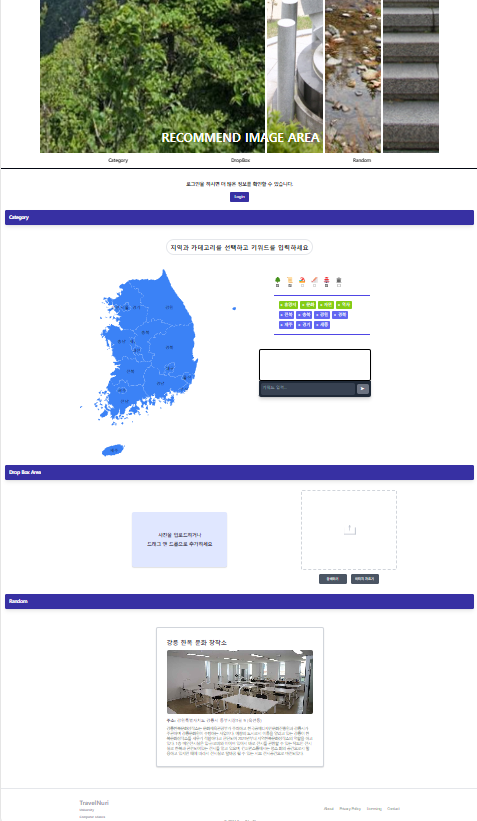
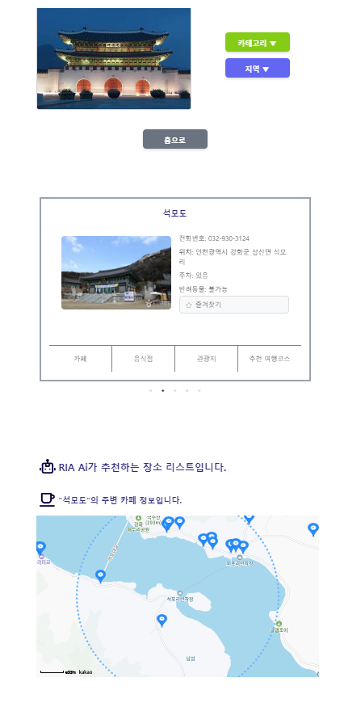
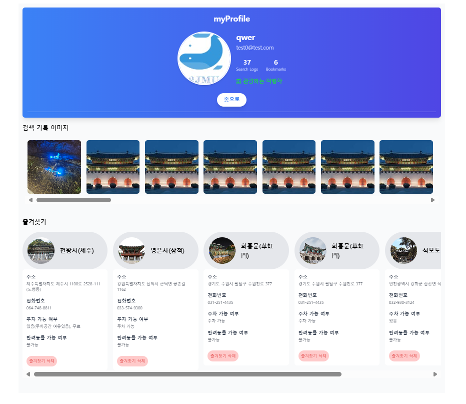

# 한국관광공사 데이터 활용 공모전

## 프로젝트 개요 
- 사용자가 업로드한 이미지를 분석해서 비슷한 이미지를 한국관광공사 데이터에서 추출하여 지도에 렌더링하고 기록을 남길 수 있는 웹 애플리케이션입니다.
  
## 주요 페이지

### 1. 메인 페이지
- 이미지 업로드 및 분석 기능
- 주요 기능에 대한 안내
- 한국관광 명소 소개
  

### 2. 검색 결과 페이지
- 업로드된 이미지와 유사한 이미지를 한국관광공사 데이터에서 추출하여 표시
- 지도 상에서 결과 위치 시각화
  

### 3. 마이 프로필 페이지
- 사용자 기록 관리
- 즐겨찾기 및 업로드한 이미지 관리
  

## 사용 기술
- **React**: 사용자 인터페이스 구성
- **Tailwind CSS**: 스타일링을 위한 유틸리티 기반 CSS 프레임워크
- **Redux**: 애플리케이션 상태 관리
- **Axios**: API 요청을 위한 HTTP 클라이언트

